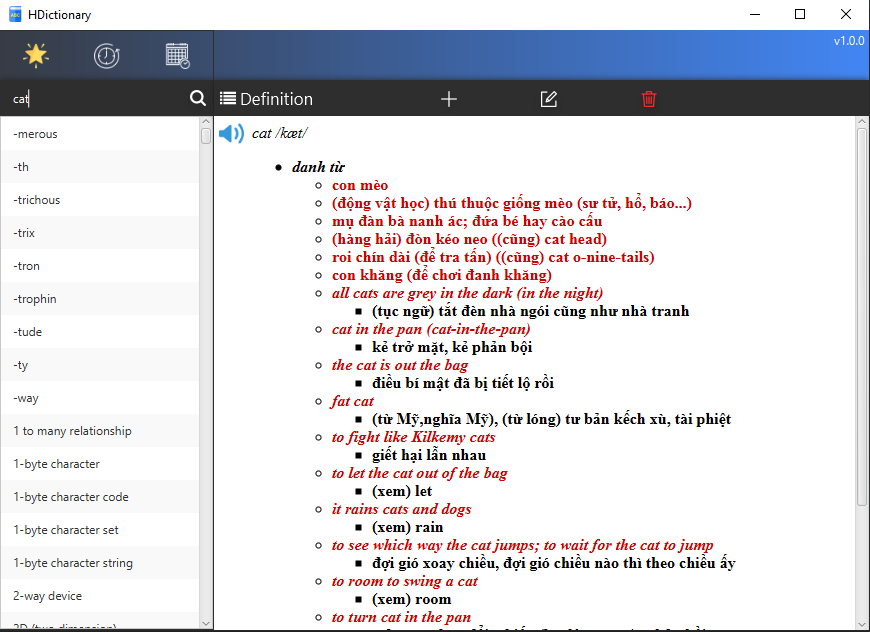
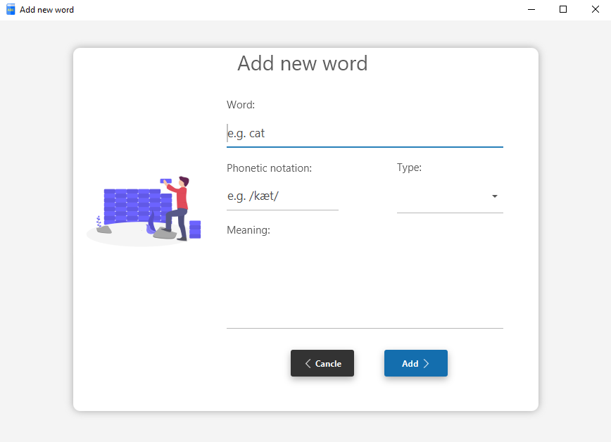

# HDictionary_19021290

A simple dictionary built with JavaFX

---

### Features

- Search, add, edit, delete word
- Pronounce word

### Techs

This dictionary uses a number of open source projects :

- [JavaFX](https://openjfx.io/)
- [JFoenix](http://www.jfoenix.com/) - JavaFX material design library
- [FreeTTS](https://freetts.sourceforge.io/)- A speech synthesizer written entirely in the JavaTM programming language
- [SceneBuilder](https://gluonhq.com/products/scene-builder/) - Drag & Drop, Rapid Application Development.
- [IntellijIDEA](https://www.jetbrains.com/idea/) - Amazing Java IDEA

### Usage

### Demo

---

### License

MIT
